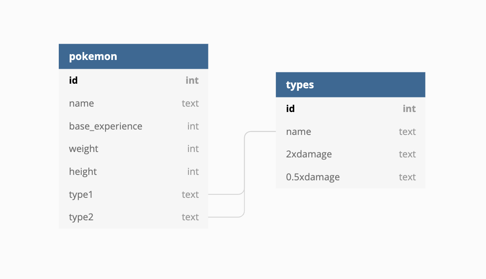

# Module 2 Assessment

Welcome to your Mod 2 Assessment. You will be tested for your understanding of concepts and ability to solve problems that have been covered in class and in the curriculum.

Use any libraries you want to solve the problems in the assessment.

You will have up to two hours to complete this assessment.

The sections of the assessment are:

- Accessing Data Through APIs
- Object Oriented Programming
- SQL and Relational Databases
- HTML, CSS and Web Scraping
- Other Database Structures (MongoDB)

In this assessment you will be exploring two datasets: Pokemon and Quotes.


```python
# import the necessary libraries

import requests
import json
import pandas as pd
import sqlite3
from bs4 import BeautifulSoup
import pymongo
```

## Part 1: Accessing Data Through APIs

In this section we'll be using PokeAPI to get data on Pokemon. Let's first define functions to get information from the API. Provided below is a URL that will get you started with the first 151 Pokemon! Run the cell below to see what we get.


```python
url = 'https://pokeapi.co/api/v2/pokemon/?limit=151'
results = requests.get(url).json()['results']
results
```

[Read the documentation here](https://pokeapi.co/) for information on navigating this API and use the API to obtain data to answer the following questions.

### Accessing Data

1. For any **one** Pokemon, retrieve the following information in a dictionary format with the following keys:
    - ID
    - Name
    - Base experience
    - Weight
    - Height
    - Types
    - Abilities

For `Types` and `Abilities`, you might want to write helper functions to have each attribute just be a list of types and a list of abilities. Your output should look like this:

```
{'id': 1, 
'name': 'bulbasaur', 
'base_experience': 64, 
'weight': 69, 
'height': 7, 
'types': ['poison', 'grass'], 
'abilities': ['chlorophyll', 'overgrow']}

```
    


```python
# you may define helper functions for types and abilities here

```


```python

def get_pokedata(url):
    
    """
    url is a string of the URL that will get you the relevant info from the API
    
    this function should return the dictionary for ONE pokemon
    
    """
    
    pass

```

### Pagination

2. Get the same information for the first **151** Pokemon as a list of dictionaries ordered by Pokemon ID. Print the first and last elements of the list. (Hint: Use pagination) Your output should save the list to a variable and look like this:

```
[{'id': 1, 
'name': 'bulbasaur', 
'base_experience': 64, 
'weight': 69, 
'height': 7, 
'types': ['poison', 'grass'], 
'abilities': ['chlorophyll', 'overgrow']}, 
{'id': 2, 
'name': 'ivysaur', 
'base_experience': 142, 
'weight': 130, 
'height': 10, 
'types': ['poison', 'grass'], 
'abilities': ['chlorophyll', 'overgrow']}, ... ]

```


```python
""" 

Assign to "pokedata" the list of 151 dictionaries.
You may use your function from the previous question.

"""

# Your code here


pokedata = None

```


```python
# printing first and last elements

print(pokedata[0], pokedata[-1])
```

## Part 2: Object Oriented Programming

We're going to use the data gathered in the previous section on APIs for this section on Object Oriented Programming to instantiate Pokemon objects and write instance methods.

### Creating a Class

1. Create a class called `Pokemon` with an `__init__` method to instantiate the following attributes:
    - ID
    - Name
    - Base experience
    - Weight
    - Height
    - Types
    - Abilities
    


```python
# if you were unable to get the data from the API in the right format,
# uncomment the code below to access a JSON file with the list of dictionaries

# with open('data/pokemon.json') as f:  
#     pokelist = json.load(f)
```


```python
"""
Create your class below with the correct syntax, including an __init__ method.

"""
        

```

    
### Instantiating Objects

2. Using the data you obtained from the API, instantiate the first, fourth and seventh Pokemon. Assign them to the variables `bulbasaur`, `charmander` and `squirtle`.


```python
# Your code here


```


```python
# run this cell to test and check your code
# you may need to edit the attribute variable names if you named them differently!

def print_pokeinfo(pokemon_object):
    o = pokemon_object
    print('ID: ' + str(o.ID) + '\n' +
          'Name: ' + o.name.title() + '\n' +
          'Base experience: ' + str(o.exp) + '\n' +
          'Weight: ' + str(o.weight) + '\n' +
          'Height: ' + str(o.height) + '\n' +
          'Types: ' + str(o.types) + '\n' +
          'Abilities: ' + str(o.abilities) + '\n'
         )
    
print_pokeinfo(bulbasaur)
print_pokeinfo(ivysaur)
print_pokeinfo(venusaur)
```

### Instance Methods

3. Write an instance method within the class `Pokemon` to find the BMI of a Pokemon. BMI is defined by $\frac{weight}{height^{2}}$ with weight in **kilograms** and height in **meters**. The height and weight data of Pokemon from the API is in **decimeters** and **hectograms** respectively.


    1 decimeter = 0.1 meters
    1 hectogram = 0.1 kilograms


```python
# run this cell to test and check your code
# you will probably have to rerun the code to instantiate your objects

print(bulbasaur.bmi()) # 14.08
print(charmander.bmi()) # 23.61
print(squirtle.bmi()) # 36
```

## Part 3: SQL and Relational Databases

For this section, we've put the Pokemon data into SQL tables. You won't need to use your list of dictionaries or the JSON file for this section. The schema of `pokemon.db` is as follows:



Assign your SQL queries as strings to the variables `q1`, `q2`, etc. and run the cells at the end of this section to print your results as Pandas DataFrames.

- q1: query all columns from `Pokemon` the Pokemon that have base_experience above 200  

  
- q2: query the id, name, type1 and type2 of Pokemon that have **water** types as either their first or second type


- q3: query the average weight of Pokemon by their first type in descending order


- q4: query the Pokemon name, Pokemon type2, and what **type2** has "2xdamage" to


- q5: query the top 5 most common type1s, the minimum height, maximum height, minimum weight and maximum weight of pokemon with those type1s, and what associated type they do "0.5xdamage" to


**Important note on syntax**: use `double quotes ""` when quoting strings **within** your query and wrap the entire query in `single quotes ''` For the column titles that begin with numbers, you need to wrap the column names in double quotes.


```python
cnx = sqlite3.connect('data/pokemon.db')
```


```python
q1 = ''
pd.read_sql(q1, cnx)
```


```python
q2 = ''
pd.read_sql(q2, cnx)
```


```python
q3 = ''
pd.read_sql(q3, cnx)
```


```python
q4 = ''
pd.read_sql(q4, cnx)
```


```python
q5 = ''
pd.read_sql(q5, cnx)
```

## Section 4: Web Scraping

### Accessing Data Using BeautifulSoup

Use BeautifulSoup to get quotes, authors, and tags from [Quotes to Read](http://quotes.toscrape.com/).

Before answering these questions, go to the site and inspect the page. Make sure to look at what links there are and how the site is structured.

1. Get the first author and the path for the author's page as a tuple from the [homepage](http://quotes.toscrape.com/).


```python
# Make a get request to retrieve the page
html_page = requests.get('http://quotes.toscrape.com/') 
# Pass the page contents to beautiful soup for parsing
soup = BeautifulSoup(html_page.content, 'html.parser')

# Your code here

```

2. Write a function to get **all** the authors and href links for the authors from the [homepage](http://quotes.toscrape.com/)


```python
def authors(url):
    '''
    input: url
    
    return: a dictionary of of authors and their urls
            {'author_1':'url_of_author_1', 'author_2':'url_of_author_2' ...}
    '''
    pass
```


```python
# run this cell to test the function
print(authors('http://quotes.toscrape.com/'))
print('\n')
print(authors('http://quotes.toscrape.com/page/3'))
```

### Pagination

3. Get the first author on each of the first 5 pages of quotes. You can get to the next page with the next button at the bottom of the homepage.


```python
# Your code here

```

4. Write a function to get all of the quotes from a page.


```python
def get_some_quotes(url):
    '''
    input: url, number of pages to scrap (just scrape the home page if no argument is passed in)
    
    return: a list of dictionaries of quotes with their attributes
            [{'quote':'quote_1_text', 'author':'url_of_author_1'}, 
            {'quote':'quote_2_text', 'author':'url_of_author_2', 'quote_tags':[list_of_quote_2_tags]}, ...]
    '''
    pass
```


```python
# set the function to a variable to use later
quotes_for_mongo = get_some_quotes('http://quotes.toscrape.com/' )
quotes_for_mongo
```

## Part 5: MongoDB

To do this section, open a connection to a mongo database in the terminal, using `mongod`. You will then **create**, **update**, and **read** from a mongo database.

Create and connect to a mongo database.


```python
myclient = pymongo.MongoClient("mongodb://127.0.0.1:27017/")
mydb = myclient['quote_database']
```


```python
mycollection = mydb['quote_collection']
```

1. Add the quotes you obtained from the `get_some_quotes` function for the [homepage](http://quotes.toscrape.com/) to the mongo database. (You can also use the JSON file `quotes.json` to insert data into the database) To verify that you've successfully inserted the data, query it to obtain the resulting _ids back from the `results` variable. 


```python
# if you were unable to get the data from webscraping in the right format,
# uncomment the code below to access a JSON file with the list of dictionaries

# with open(r"data/quotes.json", "r") as r:
#     data = json.load(r)
```


```python
# use the results variable to confirm the data was inserted
results = None
```

2. Query the database for all the quotes written by `'Albert Einstein'`.


```python
q1 = None
```

3. Update Steve Martin's quote with the tags for the quote stored in the variable `steve_martin_tags`.


```python
steve_martin_tags = {'quote_tags': ['change', 'deep-thoughts', 'thinking', 'world']}
update_steve = None
first_quote_tags = None

```

4. Query the database to confirm that  `'Steve Martin'` is updated with `steve_martin_tags`.


```python
q2 = None
```
